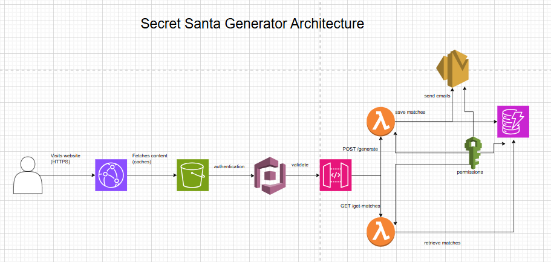

# Secret Santa Generator

A serverless Secret Santa Generator built on **AWS** using **Terraform** for infrastructure as code.  
This project allows authenticated users to create, manage, and email Secret Santa matches via a simple web interface.

---

## Architecture Overview



### Components
- **S3 + CloudFront** — Static website hosting with HTTPS and global CDN caching.  
- **Cognito** — Handles user authentication (signup/login).  
- **API Gateway** — Exposes REST endpoints for backend Lambda functions.  
- **Lambda Functions**
  - `generate_matches`: Creates random Secret Santa pairings and stores them.
  - `get_matches`: Retrieves existing matches for logged-in users.
- **DynamoDB** — Stores match data (valid for 30 days).  
- **SES** — Sends Secret Santa match emails.  
- **IAM** — Manages roles and permissions.  

---

## Project Structure

```
api-gateway.tf
app.js
auth.js
auth_navbar.js
cloudfront.tf
cognito.tf
dynamodb.tf
iam.tf
index.html
lambda.tf
lambda_function.py
lambda_function_1.py
lambda_get_matches.py
lambda_get_matches.tf
outputs.tf
provider.tf
s3-website.tf
s3.tf
ses.tf
styles.css
```

---

## Frontend Features

- Simple HTML/JS website with a snow animation.  
- Form to add participants and budget.  
- Authentication required before accessing the form.  
- CSV download for organizers.

---

## Backend Logic

- Randomized Secret Santa pair generation.  
- Stores match data in DynamoDB.  
- Sends participant match emails via AWS SES.  
- Sessions expire after 30 days.

---

## Deployment

1. Configure AWS credentials.  
2. Deploy infrastructure:
   ```bash
   terraform init
   terraform apply
   ```
3. Upload frontend files to the S3 bucket.  
4. Access your website via the CloudFront domain (HTTPS enabled).

---

